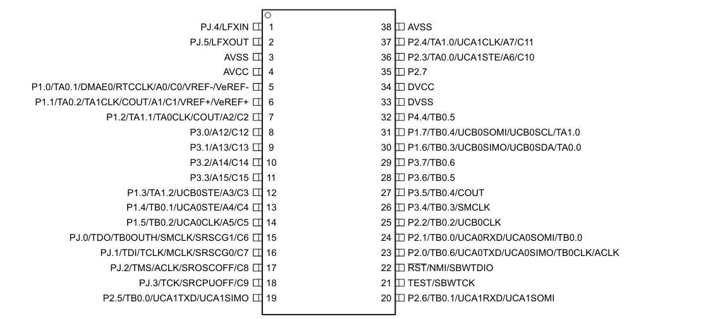

# EnergiaFR5949
Energia pinmap for MSP430FR5949 LFXT chip.

## Installing
- Download repo as a zip
- Install energia
- Copy the hardware folder and merge with energia's hardware folder (paste into energia directory)

## Pin Numbers:
- Numbers match the package pin numbers
    - Top left = pin #1 = PJ.4
    - Bottom right = pin #20 = P2.6
- UART (Debug, Serial)
    - RXD = P2.1 = 24
    - TXD = P2.0 = 23
- UART (Alternate, Serial1)
    - RXD = P2.6 = 20
    - TXD = P2.5 = 19.
- SPI (Cannot be used at same time as hardware I2C)
    - SS = P3.4 = 26
    - SCK = P2.2 = 25
    - MOSI = P1.6 = 30
    - MISO = P1.7 = 31
- I2C (Wire) hardware (cannot be used at the same time as SPI)
    - SDA = P1.6 = 30
    - SCL = P1.7 = 31
- I2C (Wire) software (can be used at the same time as SPI)
    - SDA = P3.6 = 28
    - SCL = P3.5 = 27

Credit: Pinout diagram from TI datasheet. 

## Todo
- Nice pinout diagram
- Internal temperature sensor (verify that it is same config as on 5969 used on launchpad)
- Test UART (Serial)
